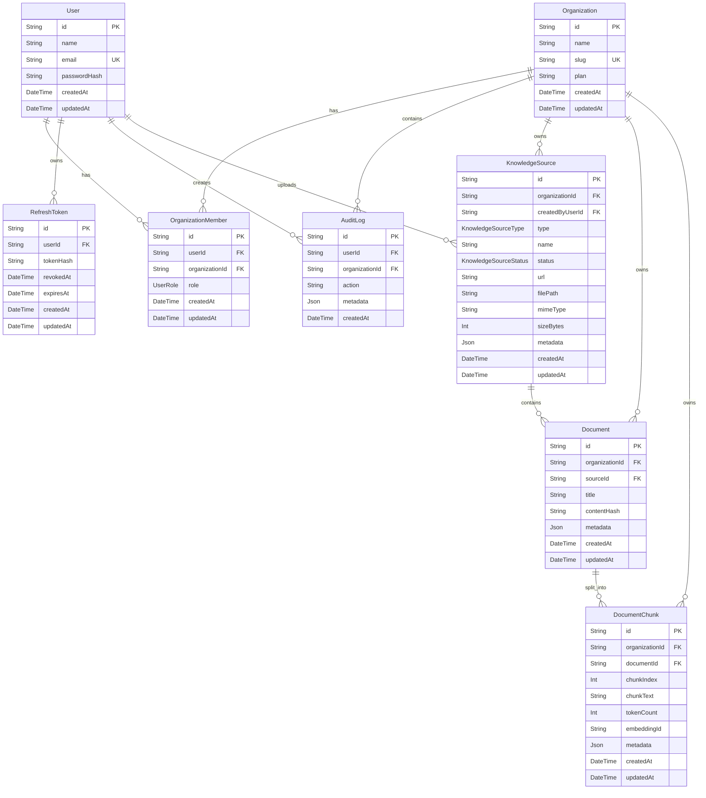

# ResolveAI Database ER Diagram

```mermaid
erDiagram
    User ||--o{ OrganizationMember : has
    Organization ||--o{ OrganizationMember : has
    User ||--o{ RefreshToken : owns
    User ||--o{ AuditLog : creates
    Organization ||--o{ AuditLog : contains

    Organization ||--o{ KnowledgeSource : owns
    User ||--o{ KnowledgeSource : uploads
    KnowledgeSource ||--o{ Document : contains
    Organization ||--o{ Document : owns
    Document ||--o{ DocumentChunk : split_into
    Organization ||--o{ DocumentChunk : owns

    User {
        String id PK
        String name
        String email UK
        String passwordHash
        DateTime createdAt
        DateTime updatedAt
    }

    Organization {
        String id PK
        String name
        String slug UK
        String plan
        DateTime createdAt
        DateTime updatedAt
    }

    OrganizationMember {
        String id PK
        String userId FK
        String organizationId FK
        UserRole role
        DateTime createdAt
        DateTime updatedAt
    }

    RefreshToken {
        String id PK
        String userId FK
        String tokenHash
        DateTime revokedAt
        DateTime expiresAt
        DateTime createdAt
        DateTime updatedAt
    }

    AuditLog {
        String id PK
        String userId FK
        String organizationId FK
        String action
        Json metadata
        DateTime createdAt
    }

    KnowledgeSource {
        String id PK
        String organizationId FK
        String createdByUserId FK
        KnowledgeSourceType type
        String name
        KnowledgeSourceStatus status
        String url
        String filePath
        String mimeType
        Int sizeBytes
        Json metadata
        DateTime createdAt
        DateTime updatedAt
    }

    Document {
        String id PK
        String organizationId FK
        String sourceId FK
        String title
        String contentHash
        Json metadata
        DateTime createdAt
        DateTime updatedAt
    }

    DocumentChunk {
        String id PK
        String organizationId FK
        String documentId FK
        Int chunkIndex
        String chunkText
        Int tokenCount
        String embeddingId
        Json metadata
        DateTime createdAt
        DateTime updatedAt
    }
```
