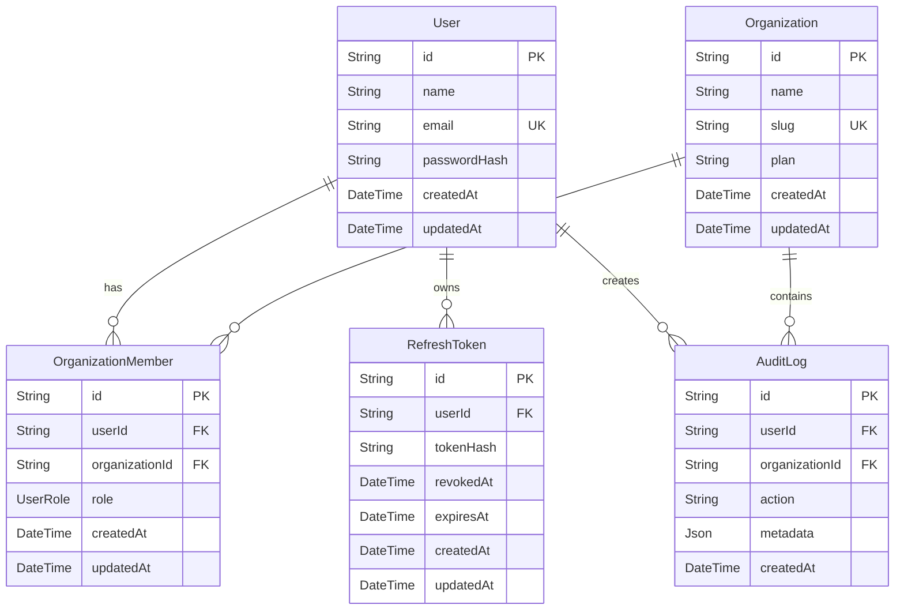

# ResolveAI Database ER Diagram

```mermaid
erDiagram
    User ||--o{ OrganizationMember : has
    Organization ||--o{ OrganizationMember : has
    User ||--o{ RefreshToken : owns
    User ||--o{ AuditLog : creates
    Organization ||--o{ AuditLog : contains

    User {
        String id PK
        String name
        String email UK
        String passwordHash
        DateTime createdAt
        DateTime updatedAt
    }

    Organization {
        String id PK
        String name
        String slug UK
        String plan
        DateTime createdAt
        DateTime updatedAt
    }

    OrganizationMember {
        String id PK
        String userId FK
        String organizationId FK
        UserRole role
        DateTime createdAt
        DateTime updatedAt
    }

    RefreshToken {
        String id PK
        String userId FK
        String tokenHash
        DateTime revokedAt
        DateTime expiresAt
        DateTime createdAt
        DateTime updatedAt
    }

    AuditLog {
        String id PK
        String userId FK
        String organizationId FK
        String action
        Json metadata
        DateTime createdAt
    }
```
